<!-- ╔══════════════════════════════════════════════════════════════════════╗ -->
<!-- ║   AS AVENTURAS DE AGNES MILLIE NO PAÍS DOS SISTEMAS                ║ -->
<!-- ╚══════════════════════════════════════════════════════════════════════╝ -->
<!-- Ilustrações: ./assets/*.svg | Cards gerados pelo workflow: ./profile/*.svg -->
<!-- Citações: Lewis Carroll, 1865 e 1871 (domínio público). Traduções livres. -->

  

  

 

  
  &nbsp;&nbsp;
  
  &nbsp;&nbsp;
  

 

  <i>“That depends a good deal on where you want to get to,” said the Cat.</i> 
  “Isso depende bastante de onde você quer chegar”, disse o Gato.

<b>Sumário</b>

  <a href="#sobre">I. Descendo a toca do coelho</a> (Sobre mim) 
  <a href="#especialidades">II. O baralho da Rainha de Copas</a> (Especialidades) 
  <a href="#stack">III. Um chá muito maluco</a> (Stack tecnológico) 
  <a href="#projetos">IV. O jardim de rosas da Rainha</a> (Projetos) 
  <a href="#metricas">V. Quando o Chapeleiro brigou com o Tempo</a> (Métricas) 
  <a href="#conquistas">VI. Todos ganharam e todos devem ter prêmios</a> (Conquistas)

<!-- ══════════════════════════════════════════════════════════════════════ -->
<!--                 CAPÍTULO I · PERFIL PROFISSIONAL                     -->
<!-- ══════════════════════════════════════════════════════════════════════ -->

  <i>“Who are YOU?” said the Caterpillar.</i> 
  “Quem é você?”, perguntou a Lagarta.

<table align="center" width="90%">
  <tr>
    <td width="58%" valign="top">
       
      <h3>Agnes Millie</h3>
      

        Sou <strong>Agnes Millie</strong>, Arquiteta de Sistemas e Desenvolvedora Full Stack especializada em construir soluções corporativas robustas, escaláveis e inteligentes.
      

      

        Atuo na interseção entre <strong>arquitetura de software</strong>, <strong>automação de processos</strong>, <strong>inteligência artificial</strong> e <strong>gestão empresarial</strong> — transformando requisitos complexos em sistemas de alto valor que impactam diretamente os resultados organizacionais.
      

      

        Cada projeto neste perfil é uma <strong>aventura cuidadosamente conduzida</strong>: do conceito à entrega, da arquitetura ao deploy, do problema à solução elegante.
      

      <blockquote>
        <em>"A tecnologia bem aplicada não apenas resolve problemas — ela transforma organizações."</em>
      </blockquote>
       
      

        
        &nbsp;
        
        &nbsp;
        
      

      

        
      

       
    </td>
    <td width="42%" valign="center" align="center">
       
      
        
      
       
    </td>
  </tr>
</table>

<!-- ══════════════════════════════════════════════════════════════════════ -->
<!--              CAPÍTULO II · CATÁLOGO DE ESPECIALIDADES                -->
<!-- ══════════════════════════════════════════════════════════════════════ -->

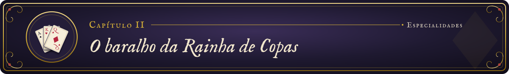

  <i>“Why, sometimes I’ve believed as many as six impossible things before breakfast.”</i> 
  “Ora, às vezes já acreditei em seis coisas impossíveis antes do café da manhã.” A Rainha Branca

<table width="92%">
  <tr>
    <td align="center" width="33%" valign="top">
       
      
        
      <strong>♠︎ Desenvolvimento Full Stack</strong>
       
      Interfaces modernas e APIs robustas, do frontend ao backend corporativo.
       
       
      
      
       
    </td>
    <td align="center" width="33%" valign="top">
       
      
        
      <strong>♥︎ Arquitetura & DevOps</strong>
       
      Infraestrutura escalável, CI/CD e orquestração de microsserviços.
       
       
      
      
       
    </td>
    <td align="center" width="33%" valign="top">
       
      
        
      <strong>♦︎ IA & Automação</strong>
       
      Machine learning, NLP e automação inteligente de processos empresariais.
       
       
      
      
       
    </td>
  </tr>
  <tr>
    <td align="center" width="33%" valign="top">
       
      
        
      <strong>♣︎ Gestão de Dados</strong>
       
      Modelagem, performance e integridade em bancos relacionais e NoSQL.
       
       
      
      
       
    </td>
    <td align="center" width="33%" valign="top">
       
      
        
      <strong>♥︎ Integração de Sistemas</strong>
       
      REST, GraphQL, webhooks e integrações corporativas complexas.
       
       
      
      
       
    </td>
    <td align="center" width="33%" valign="top">
       
      
        
      <strong>♠︎ UX/UI & Design Systems</strong>
       
      Experiências digitais elegantes, acessíveis e orientadas ao usuário.
       
       
      
      
       
    </td>
  </tr>
</table>

<!-- ══════════════════════════════════════════════════════════════════════ -->
<!--                 CAPÍTULO III · STACK TECNOLÓGICO                     -->
<!-- ══════════════════════════════════════════════════════════════════════ -->

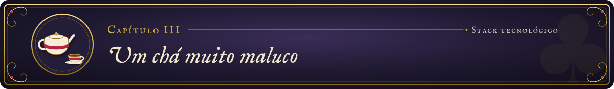

  <i>“…it’s always tea-time…”</i> 
  “…é sempre hora do chá…”, suspirou o Chapeleiro.

**Linguagens de programação**

  

**Frameworks e bibliotecas**

 

  

**Bancos de dados e storage**

  

**Cloud e infraestrutura**

  

**Ferramentas e metodologias**

<!-- ══════════════════════════════════════════════════════════════════════ -->
<!--                  CAPÍTULO IV · PROJETOS EM DESTAQUE                  -->
<!-- ══════════════════════════════════════════════════════════════════════ -->

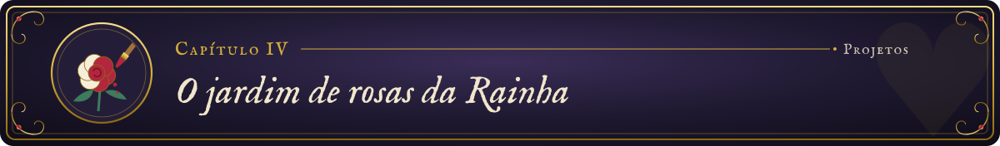

  <i>“Curiouser and curiouser!” cried Alice.</i> 
  “Cada vez mais curiosíssimo!”, exclamou Alice.

<table>
  <tr>
    <td align="center">
      <a href="https://github.com/AgnesMillie/eventflow-platform"></a>
    </td>
    <td align="center">
      <a href="https://github.com/AgnesMillie/apex-monitor"></a>
    </td>
  </tr>
  <tr>
    <td align="center">
      <a href="https://github.com/AgnesMillie/developer-snapshot-api"></a>
    </td>
    <td align="center">
      <a href="https://github.com/AgnesMillie/Audyn-2.0"></a>
    </td>
  </tr>
</table>

 

<!-- ══════════════════════════════════════════════════════════════════════ -->
<!--                CAPÍTULO V · MÉTRICAS & CONTRIBUIÇÕES                 -->
<!-- ══════════════════════════════════════════════════════════════════════ -->

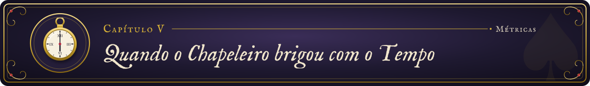

  <i>“If you knew Time as well as I do,” said the Hatter…</i> 
  “Se você conhecesse o Tempo tão bem quanto eu”, disse o Chapeleiro…

  

 

  

<!-- ══════════════════════════════════════════════════════════════════════ -->
<!--              CAPÍTULO VI · CONQUISTAS & RECONHECIMENTOS              -->
<!-- ══════════════════════════════════════════════════════════════════════ -->

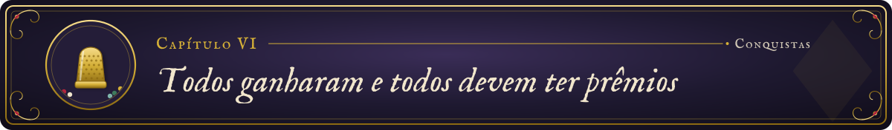

  <i>“Everybody has won, and all must have prizes.”</i> 
  “Todos ganharam, e todos devem ter prêmios”, decretou o Dodô.

  

 

<!-- ══════════════════════════════════════════════════════════════════════ -->
<!--                               FIM                                    -->
<!-- ══════════════════════════════════════════════════════════════════════ -->

  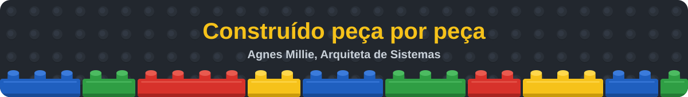

  
    <em>"O conhecimento compartilhado é o único bem que cresce ao ser distribuído."</em>
  

